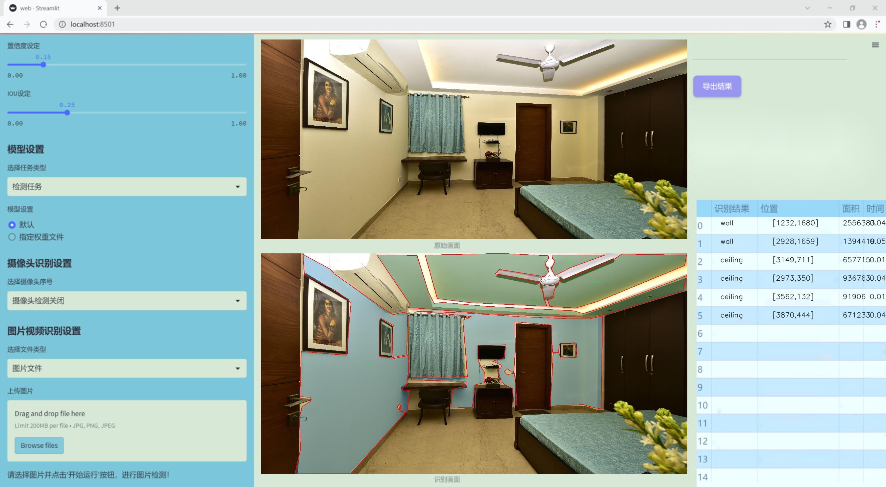
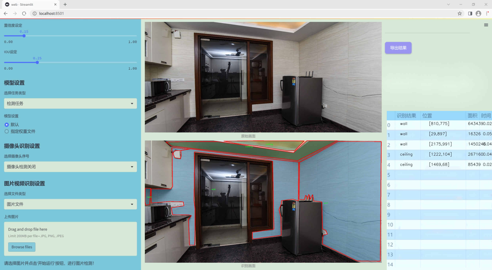
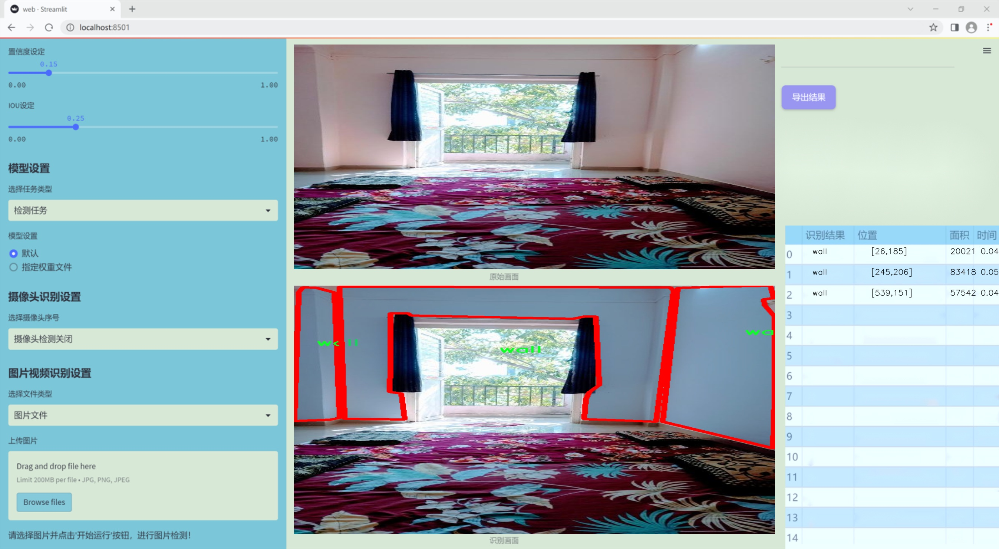
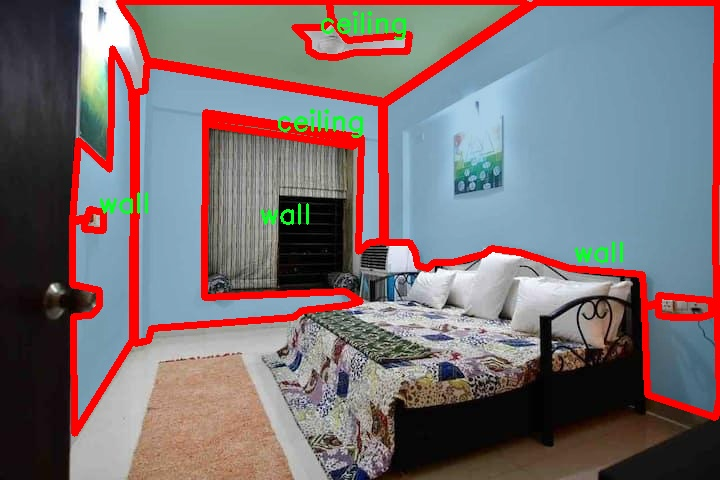
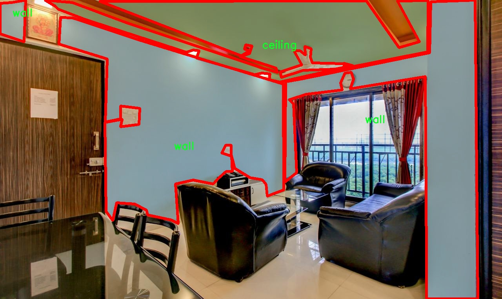
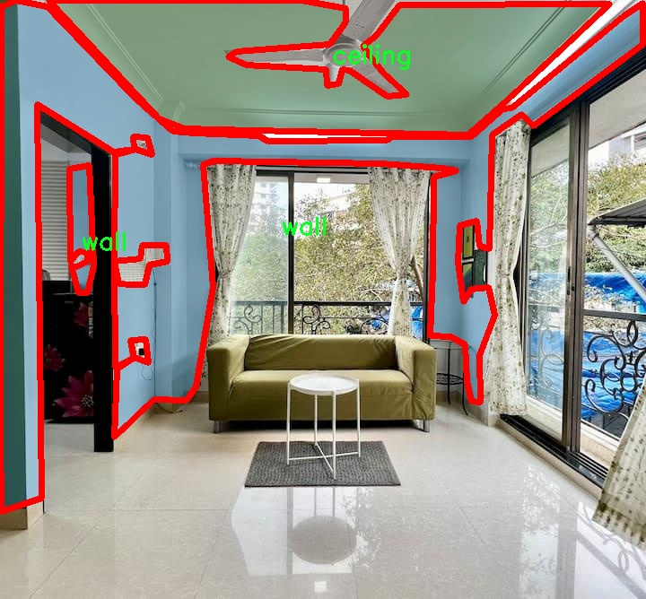
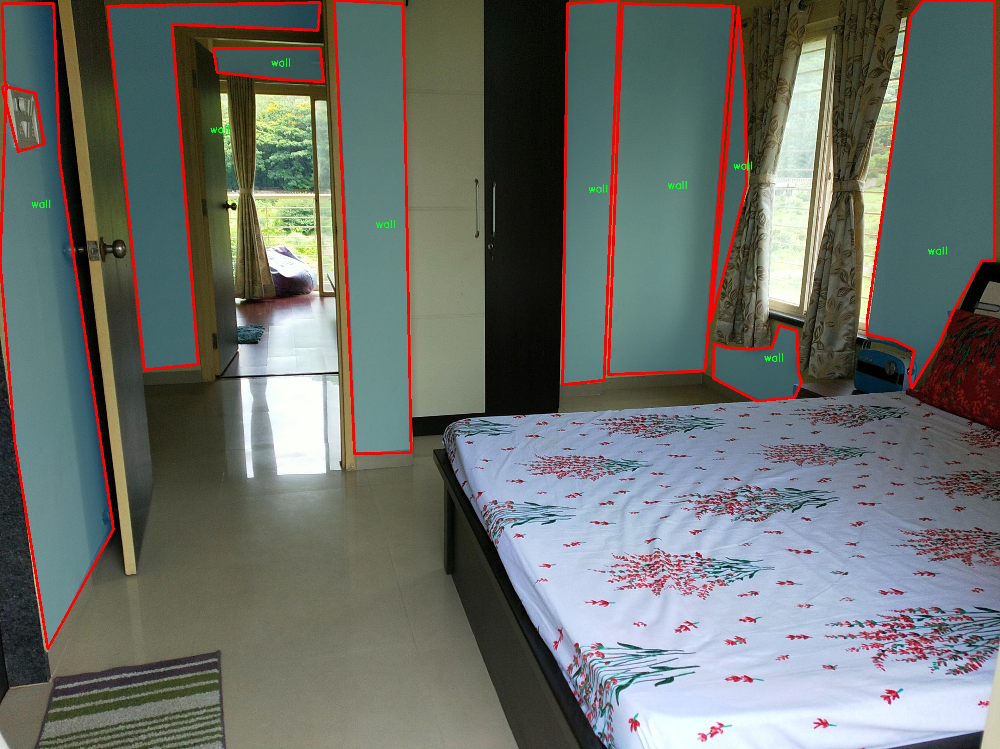
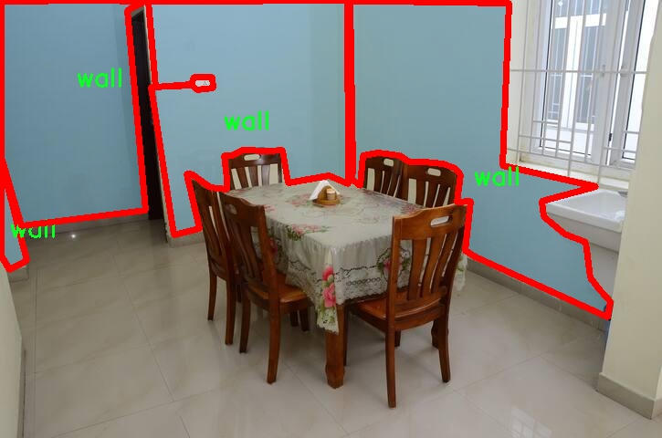

### 1.背景意义

研究背景与意义

随着智能家居和自动化技术的迅速发展，室内环境的智能识别与分析变得愈发重要。室内结构分割不仅在建筑设计、室内导航、安防监控等领域具有广泛应用前景，还为人机交互、增强现实等新兴技术提供了基础支持。近年来，深度学习技术的飞速进步为图像分割任务带来了新的机遇，尤其是YOLO（You Only Look Once）系列模型在目标检测和分割任务中表现出了优异的性能。YOLOv11作为该系列的最新版本，凭借其高效的推理速度和精确的检测能力，成为研究者们关注的焦点。

本研究旨在基于改进的YOLOv11模型，构建一个高效的室内结构分割系统，专注于墙壁和天花板的实例分割。我们所使用的数据集DandourWall-celing包含1200幅图像，涵盖了两个主要类别：墙壁和天花板。这一数据集为模型的训练和评估提供了丰富的样本，使得系统能够在多样化的室内环境中实现准确的结构识别。通过对这些类别的深入分析与分割，我们不仅能够提升室内空间的理解能力，还能为后续的智能家居系统提供更为精准的环境感知。

此外，室内结构分割系统的成功实施将为多个行业带来显著的经济效益和社会价值。建筑行业可以利用该系统进行室内布局优化，提升空间利用率；安防行业则可以通过实时监控与分析，增强安全防范能力；而在智能家居领域，用户将能够享受到更为个性化和智能化的居住体验。因此，基于改进YOLOv11的室内结构分割系统的研究，不仅具有重要的学术价值，更具备广泛的应用前景。

### 2.视频效果

[2.1 视频效果](https://www.bilibili.com/video/BV1rWqqYkEX7/)

### 3.图片效果







##### [项目涉及的源码数据来源链接](https://kdocs.cn/l/cszuIiCKVNis)**

注意：本项目提供训练的数据集和训练教程,由于版本持续更新,暂不提供权重文件（best.pt）,请按照6.训练教程进行训练后实现上图演示的效果。

### 4.数据集信息

##### 4.1 本项目数据集类别数＆类别名

nc: 2
names: ['ceiling', 'wall']


该项目为【图像分割】数据集，请在【训练教程和Web端加载模型教程（第三步）】这一步的时候按照【图像分割】部分的教程来训练

##### 4.2 本项目数据集信息介绍

本项目数据集信息介绍

本项目所使用的数据集专注于室内结构分割，特别是针对“DandourWall-celing”主题进行优化，以改进YOLOv11模型在室内环境中的表现。该数据集包含两大主要类别，分别为“ceiling”（天花板）和“wall”（墙壁），旨在为室内空间的结构分析提供高质量的标注数据。数据集的类别数量为2，简洁而高效，能够帮助模型更好地学习和识别室内环境中的关键结构元素。

在数据集的构建过程中，特别注重了样本的多样性和代表性，以确保模型在实际应用中的泛化能力。数据集中包含了不同类型的室内环境，如住宅、办公室和公共空间等，涵盖了各种光照条件和视角变化。这种多样性使得模型能够在面对不同场景时，依然保持较高的准确性和鲁棒性。

每个样本均经过精确的标注，确保“ceiling”和“wall”这两个类别的边界清晰可辨。标注过程中采用了专业的标注工具，确保每个像素的分类都尽可能准确，从而为模型训练提供了可靠的基础。此外，数据集还包含了丰富的图像背景和纹理信息，使得模型在学习过程中能够捕捉到更细微的特征。

通过对该数据集的训练，期望能够显著提升YOLOv11在室内结构分割任务中的性能，尤其是在复杂环境中的应用效果。最终目标是实现高效、准确的室内结构识别，为智能家居、室内导航等领域的进一步发展奠定坚实的基础。











### 5.全套项目环境部署视频教程（零基础手把手教学）

[5.1 所需软件PyCharm和Anaconda安装教程（第一步）](https://www.bilibili.com/video/BV1BoC1YCEKi/?spm_id_from=333.999.0.0&vd_source=bc9aec86d164b67a7004b996143742dc)


[5.2 安装Python虚拟环境创建和依赖库安装视频教程（第二步）](https://www.bilibili.com/video/BV1ZoC1YCEBw?spm_id_from=333.788.videopod.sections&vd_source=bc9aec86d164b67a7004b996143742dc)

### 6.改进YOLOv11训练教程和Web_UI前端加载模型教程（零基础手把手教学）

[6.1 改进YOLOv11训练教程和Web_UI前端加载模型教程（第三步）](https://www.bilibili.com/video/BV1BoC1YCEhR?spm_id_from=333.788.videopod.sections&vd_source=bc9aec86d164b67a7004b996143742dc)


按照上面的训练视频教程链接加载项目提供的数据集，运行train.py即可开始训练



     Epoch   gpu_mem       box       obj       cls    labels  img_size
     1/200     20.8G   0.01576   0.01955  0.007536        22      1280: 100%|██████████| 849/849 [14:42<00:00,  1.04s/it]
               Class     Images     Labels          P          R     mAP@.5 mAP@.5:.95: 100%|██████████| 213/213 [01:14<00:00,  2.87it/s]
                 all       3395      17314      0.994      0.957      0.0957      0.0843

     Epoch   gpu_mem       box       obj       cls    labels  img_size
     2/200     20.8G   0.01578   0.01923  0.007006        22      1280: 100%|██████████| 849/849 [14:44<00:00,  1.04s/it]
               Class     Images     Labels          P          R     mAP@.5 mAP@.5:.95: 100%|██████████| 213/213 [01:12<00:00,  2.95it/s]
                 all       3395      17314      0.996      0.956      0.0957      0.0845

     Epoch   gpu_mem       box       obj       cls    labels  img_size
     3/200     20.8G   0.01561    0.0191  0.006895        27      1280: 100%|██████████| 849/849 [10:56<00:00,  1.29it/s]
               Class     Images     Labels          P          R     mAP@.5 mAP@.5:.95: 100%|███████   | 187/213 [00:52<00:00,  4.04it/s]
                 all       3395      17314      0.996      0.957      0.0957      0.0845


###### [项目数据集下载链接](https://kdocs.cn/l/cszuIiCKVNis)

### 7.原始YOLOv11算法讲解

##### YOLO11简介

> YOLO11源码地址：https://github.com/ultralytics/ultralytics

Ultralytics
YOLO11是一款尖端的、最先进的模型，它在之前YOLO版本成功的基础上进行了构建，并引入了新功能和改进，以进一步提升性能和灵活性。YOLO11设计快速、准确且易于使用，使其成为各种物体检测和跟踪、实例分割、图像分类以及姿态估计任务的绝佳选择。  


**YOLO11创新点如下:**

YOLO 11主要改进包括：  
`增强的特征提取`：YOLO 11采用了改进的骨干和颈部架构，增强了特征提取功能，以实现更精确的目标检测。  
`优化的效率和速度`：优化的架构设计和优化的训练管道提供更快的处理速度，同时保持准确性和性能之间的平衡。  
`更高的精度，更少的参数`：YOLO11m在COCO数据集上实现了更高的平均精度（mAP），参数比YOLOv8m少22%，使其在不影响精度的情况下提高了计算效率。  
`跨环境的适应性`：YOLO 11可以部署在各种环境中，包括边缘设备、云平台和支持NVIDIA GPU的系统。  
`广泛的支持任务`：YOLO 11支持各种计算机视觉任务，如对象检测、实例分割、图像分类、姿态估计和面向对象检测（OBB）。

**YOLO11不同模型尺寸信息：**

YOLO11 提供5种不同的型号规模模型，以满足不同的应用需求：

Model| size (pixels)| mAPval 50-95| Speed CPU ONNX (ms)| Speed T4 TensorRT10
(ms)| params (M)| FLOPs (B)  
---|---|---|---|---|---|---  
YOLO11n| 640| 39.5| 56.1 ± 0.8| 1.5 ± 0.0| 2.6| 6.5  
YOLO11s| 640| 47.0| 90.0 ± 1.2| 2.5 ± 0.0| 9.4| 21.5  
YOLO11m| 640| 51.5| 183.2 ± 2.0| 4.7 ± 0.1| 20.1| 68.0  
YOLO11l| 640| 53.4| 238.6 ± 1.4| 6.2 ± 0.1| 25.3| 86.9  
YOLO11x| 640| 54.7| 462.8 ± 6.7| 11.3 ± 0.2| 56.9| 194.9  
  
**模型常用训练超参数参数说明：**  
`YOLOv11
模型的训练设置包括训练过程中使用的各种超参数和配置`。这些设置会影响模型的性能、速度和准确性。关键的训练设置包括批量大小、学习率、动量和权重衰减。此外，优化器、损失函数和训练数据集组成的选择也会影响训练过程。对这些设置进行仔细的调整和实验对于优化性能至关重要。  
**以下是一些常用的模型训练参数和说明：**

参数名| 默认值| 说明  
---|---|---  
`model`| `None`| 指定用于训练的模型文件。接受指向 `.pt` 预训练模型或 `.yaml`
配置文件。对于定义模型结构或初始化权重至关重要。  
`data`| `None`| 数据集配置文件的路径（例如
`coco8.yaml`).该文件包含特定于数据集的参数，包括训练数据和验证数据的路径、类名和类数。  
`epochs`| `100`| 训练总轮数。每个epoch代表对整个数据集进行一次完整的训练。调整该值会影响训练时间和模型性能。  
`patience`| `100`| 在验证指标没有改善的情况下，提前停止训练所需的epoch数。当性能趋于平稳时停止训练，有助于防止过度拟合。  
`batch`| `16`| 批量大小，有三种模式:设置为整数(例如，’ Batch =16 ‘)， 60% GPU内存利用率的自动模式(’ Batch
=-1 ‘)，或指定利用率分数的自动模式(’ Batch =0.70 ')。  
`imgsz`| `640`| 用于训练的目标图像尺寸。所有图像在输入模型前都会被调整到这一尺寸。影响模型精度和计算复杂度。  
`device`| `None`| 指定用于训练的计算设备：单个 GPU (`device=0`）、多个 GPU (`device=0,1`)、CPU
(`device=cpu`)，或苹果芯片的 MPS (`device=mps`).  
`workers`| `8`| 加载数据的工作线程数（每 `RANK` 多 GPU 训练）。影响数据预处理和输入模型的速度，尤其适用于多 GPU 设置。  
`name`| `None`| 训练运行的名称。用于在项目文件夹内创建一个子目录，用于存储训练日志和输出结果。  
`pretrained`| `True`| 决定是否从预处理模型开始训练。可以是布尔值，也可以是加载权重的特定模型的字符串路径。提高训练效率和模型性能。  
`optimizer`| `'auto'`| 为训练模型选择优化器。选项包括 `SGD`, `Adam`, `AdamW`, `NAdam`,
`RAdam`, `RMSProp` 等，或 `auto` 用于根据模型配置进行自动选择。影响收敛速度和稳定性  
`lr0`| `0.01`| 初始学习率（即 `SGD=1E-2`, `Adam=1E-3`) .调整这个值对优化过程至关重要，会影响模型权重的更新速度。  
`lrf`| `0.01`| 最终学习率占初始学习率的百分比 = (`lr0 * lrf`)，与调度程序结合使用，随着时间的推移调整学习率。  


**各损失函数作用说明：**  
`定位损失box_loss`：预测框与标定框之间的误差（GIoU），越小定位得越准；  
`分类损失cls_loss`：计算锚框与对应的标定分类是否正确，越小分类得越准；  
`动态特征损失（dfl_loss）`：DFLLoss是一种用于回归预测框与目标框之间距离的损失函数。在计算损失时，目标框需要缩放到特征图尺度，即除以相应的stride，并与预测的边界框计算Ciou
Loss，同时与预测的anchors中心点到各边的距离计算回归DFLLoss。  


### 8.200+种全套改进YOLOV11创新点原理讲解

#### 8.1 200+种全套改进YOLOV11创新点原理讲解大全

由于篇幅限制，每个创新点的具体原理讲解就不全部展开，具体见下列网址中的改进模块对应项目的技术原理博客网址【Blog】（创新点均为模块化搭建，原理适配YOLOv5~YOLOv11等各种版本）

[改进模块技术原理博客【Blog】网址链接](https://gitee.com/qunmasj/good)


#### 8.2 精选部分改进YOLOV11创新点原理讲解

###### 这里节选部分改进创新点展开原理讲解(完整的改进原理见上图和[改进模块技术原理博客链接](https://gitee.com/qunmasj/good)【如果此小节的图加载失败可以通过CSDN或者Github搜索该博客的标题访问原始博客，原始博客图片显示正常】



### 视觉transformer(ViT)简介
视觉transformer(ViT)最近在各种计算机视觉任务中证明了巨大的成功，并受到了相当多的关注。与卷积神经网络(CNNs)相比，ViT具有更强的全局信息捕获能力和远程交互能力，表现出优于CNNs的准确性，特别是在扩大训练数据大小和模型大小时[An image is worth 16x16 words: Transformers for image recognition at scale,Coatnet]。

尽管ViT在低分辨率和高计算领域取得了巨大成功，但在高分辨率和低计算场景下，ViT仍不如cnn。例如，下图(左)比较了COCO数据集上当前基于cnn和基于vit的一级检测器。基于vit的检测器(160G mac)和基于cnn的检测器(6G mac)之间的效率差距超过一个数量级。这阻碍了在边缘设备的实时高分辨率视觉应用程序上部署ViT。


左图:现有的基于vit的一级检测器在实时目标检测方面仍然不如当前基于cnn的一级检测器，需要的计算量多出一个数量级。本文引入了第一个基于vit的实时对象检测器来弥补这一差距。在COCO上，efficientvit的AP比efficientdet高3.8，而mac较低。与YoloX相比，efficient ViT节省67.2%的计算成本，同时提供更高的AP。

中:随着输入分辨率的增加，计算成本呈二次增长，无法有效处理高分辨率的视觉应用。

右图:高分辨率对图像分割很重要。当输入分辨率从1024x2048降低到512x1024时，MobileNetV2的mIoU减少12% (8.5 mIoU)。在不提高分辨率的情况下，只提高模型尺寸是无法缩小性能差距的。

ViT的根本计算瓶颈是softmax注意模块，其计算成本随输入分辨率的增加呈二次增长。例如，如上图(中)所示，随着输入分辨率的增加，vit- small[Pytorch image models. https://github.com/rwightman/ pytorch-image-models]的计算成本迅速显著大于ResNet-152的计算成本。

解决这个问题的一个直接方法是降低输入分辨率。然而，高分辨率的视觉识别在许多现实世界的计算机视觉应用中是必不可少的，如自动驾驶，医疗图像处理等。当输入分辨率降低时，图像中的小物体和精细细节会消失，导致目标检测和语义分割性能显著下降。

上图(右)显示了在cityscape数据集上不同输入分辨率和宽度乘法器下MobileNetV2的性能。例如，将输入分辨率从1024x2048降低到512x1024会使cityscape的性能降低12% (8.5 mIoU)。即使是3.6倍高的mac，只放大模型尺寸而不增加分辨率也无法弥补这一性能损失。

除了降低分辨率外，另一种代表性的方法是限制softmax注意，方法是将其范围限制在固定大小的局部窗口内[Swin transformer,Swin transformer v2]或降低键/值张量的维数[Pyramid vision transformer,Segformer]。然而，它损害了ViT的非局部注意能力，降低了全局接受域(ViT最重要的优点)，使得ViT与大内核cnn的区别更小[A convnet for the 2020s,Scaling up your kernels to 31x31: Revisiting large kernel design in cnns,Lite pose: Efficient architecture design for 2d human pose estimation]。

本文介绍了一个有效的ViT体系结构，以解决这些挑战。发现没有必要坚持softmax注意力。本文建议用线性注意[Transformers are rnns: Fast autoregressive transformers with linear attention]代替softmax注意。

线性注意的关键好处是，它保持了完整的n 2 n^2n 2
 注意映射，就像softmax注意。同时，它利用矩阵乘法的联想特性，避免显式计算完整的注意映射，同时保持相同的功能。因此，它保持了softmax注意力的全局特征提取能力，且计算复杂度仅为线性。线性注意的另一个关键优点是它避免了softmax，这使得它在移动设备上更有效(下图左)。


左图:线性注意比类似mac下的softmax注意快3.3-4.5倍，这是因为去掉了硬件效率不高的softmax功能。延迟是在Qualcomm Snapdragon 855 CPU和TensorFlow-Lite上测量的。本文增加线性注意的头部数量，以确保它具有与softmax注意相似的mac。

中:然而，如果没有softmax注意中使用的非线性注意评分归一化，线性注意无法有效集中其注意分布，削弱了其局部特征提取能力。后文提供了可视化。

右图:本文用深度卷积增强线性注意，以解决线性注意的局限性。深度卷积可以有效地捕捉局部特征，而线性注意可以专注于捕捉全局信息。增强的线性注意在保持线性注意的效率和简单性的同时，表现出在各种视觉任务上的强大表现(图4)。

然而，直接应用线性注意也有缺点。以往的研究表明线性注意和softmax注意之间存在显著的性能差距(下图中间)。


左:高通骁龙855上的精度和延迟权衡。效率vit比效率网快3倍，精度更高。中:ImageNet上softmax注意与线性注意的比较。在相同的计算条件下，本文观察到softmax注意与线性注意之间存在显著的精度差距。而深度卷积增强模型后，线性注意的精度有明显提高。

相比之下，softmax注意的精度变化不大。在相同MAC约束下，增强线性注意比增强软最大注意提高了0.3%的精度。右图:与增强的softmax注意相比，增强的线性注意硬件效率更高，随着分辨率的增加，延迟增长更慢。

深入研究线性注意和softmax注意的详细公式，一个关键的区别是线性注意缺乏非线性注意评分归一化方案。这使得线性注意无法有效地将注意力分布集中在局部模式产生的高注意分数上，从而削弱了其局部特征提取能力。

本文认为这是线性注意的主要限制，使其性能不如softmax注意。本文提出了一个简单而有效的解决方案来解决这一限制，同时保持线性注意在低复杂度和低硬件延迟方面的优势。具体来说，本文建议通过在每个FFN层中插入额外的深度卷积来增强线性注意。因此，本文不需要依赖线性注意进行局部特征提取，避免了线性注意在捕捉局部特征方面的不足，并利用了线性注意在捕捉全局特征方面的优势。

本文广泛评估了efficient vit在低计算预算下对各种视觉任务的有效性，包括COCO对象检测、城市景观语义分割和ImageNet分类。本文想要突出高效的主干设计，所以没有包括任何正交的附加技术(例如，知识蒸馏，神经架构搜索)。尽管如此，在COCO val2017上，efficientvit的AP比efficientdet - d1高2.4倍，同时节省27.9%的计算成本。在cityscape上，efficientvit提供了比SegFormer高2.5个mIoU，同时降低了69.6%的计算成本。在ImageNet上，efficientvit在584M mac上实现了79.7%的top1精度，优于efficientnet - b1的精度，同时节省了16.6%的计算成本。

与现有的以减少参数大小或mac为目标的移动ViT模型[Mobile-former,Mobilevit,NASVit]不同，本文的目标是减少移动设备上的延迟。本文的模型不涉及复杂的依赖或硬件低效操作。因此，本文减少的计算成本可以很容易地转化为移动设备上的延迟减少。

在高通骁龙855 CPU上，efficient vit运行速度比efficientnet快3倍，同时提供更高的ImageNet精度。本文的代码和预训练的模型将在出版后向公众发布。

### Efficient Vision Transformer.
提高ViT的效率对于在资源受限的边缘平台上部署ViT至关重要，如手机、物联网设备等。尽管ViT在高计算区域提供了令人印象深刻的性能，但在针对低计算区域时，它通常不如以前高效的cnn[Efficientnet, mobilenetv3,Once for all: Train one network and specialize it for efficient deployment]。为了缩小差距，MobileViT建议结合CNN和ViT的长处，使用transformer将卷积中的局部处理替换为全局处理。MobileFormer提出了在MobileNet和Transformer之间建立双向桥以实现特征融合的并行化。NASViT提出利用神经架构搜索来搜索高效的ViT架构。

这些模型在ImageNet上提供了极具竞争力的准确性和效率的权衡。然而，它们并不适合高分辨率的视觉任务，因为它们仍然依赖于softmax注意力。


在本节中，本文首先回顾了自然语言处理中的线性注意，并讨论了它的优缺点。接下来，本文介绍了一个简单而有效的解决方案来克服线性注意的局限性。最后，给出了efficient vit的详细架构。

 为可学习投影矩阵。Oi表示矩阵O的第i行。Sim(·，·)为相似度函数。

虽然softmax注意力在视觉和NLP方面非常成功，但它并不是唯一的选择。例如，线性注意提出了如下相似度函数:


其中，φ(·)为核函数。在本工作中，本文选择了ReLU作为内核函数，因为它对硬件来说是友好的。当Sim(Q, K) = φ(Q)φ(K)T时，式(1)可改写为:


线性注意的一个关键优点是，它允许利用矩阵乘法的结合律，在不改变功能的情况下，将计算复杂度从二次型降低到线性型:


除了线性复杂度之外，线性注意的另一个关键优点是它不涉及注意模块中的softmax。Softmax在硬件上效率非常低。避免它可以显著减少延迟。例如，下图(左)显示了softmax注意和线性注意之间的延迟比较。在类似的mac上，线性注意力比移动设备上的softmax注意力要快得多。


#### EfficientViT
Enhancing Linear Attention with Depthwise Convolution

虽然线性注意在计算复杂度和硬件延迟方面优于softmax注意，但线性注意也有局限性。以往的研究[\[Luna: Linear unified nested attention,Random feature attention,Combiner: Full attention transformer with sparse computation cost,cosformer: Rethinking softmax in attention\]](https://afdian.net/item/602b9612927111ee9ec55254001e7c00)表明，在NLP中线性注意和softmax注意之间通常存在显著的性能差距。对于视觉任务，之前的研究[Visual correspondence hallucination,Quadtree attention for vision transformers]也表明线性注意不如softmax注意。在本文的实验中，本文也有类似的观察结果(图中)。


本文对这一假设提出了质疑，认为线性注意的低劣性能主要是由于局部特征提取能力的丧失。如果没有在softmax注意中使用的非线性评分归一化，线性注意很难像softmax注意那样集中其注意分布。下图(中间)提供了这种差异的示例。


在相同的原始注意力得分下，使用softmax比不使用softmax更能集中注意力。因此，线性注意不能有效地聚焦于局部模式产生的高注意分数(下图)，削弱了其局部特征提取能力。


注意图的可视化显示了线性注意的局限性。通过非线性注意归一化，softmax注意可以产生清晰的注意分布，如中间行所示。相比之下，线性注意的分布相对平滑，使得线性注意在捕捉局部细节方面的能力较弱，造成了显著的精度损失。本文通过深度卷积增强线性注意来解决这一限制，并有效提高了准确性。

介绍了一个简单而有效的解决方案来解决这个限制。本文的想法是用卷积增强线性注意，这在局部特征提取中是非常有效的。这样，本文就不需要依赖于线性注意来捕捉局部特征，而可以专注于全局特征提取。具体来说，为了保持线性注意的效率和简单性，本文建议在每个FFN层中插入一个深度卷积，这样计算开销很小，同时极大地提高了线性注意的局部特征提取能力。

#### Building Block

下图(右)展示了增强线性注意的详细架构，它包括一个线性注意层和一个FFN层，在FFN的中间插入深度卷积。


与之前的方法[Swin transformer,Coatnet]不同，本文在efficientvit中没有使用相对位置偏差。相对位置偏差虽然可以改善模型的性能，但它使模型容易受到分辨率变化[Segformer]的影响。多分辨率训练或新分辨率下的测试在检测和分割中很常见。去除相对位置偏差使高效率vit对输入分辨率更加灵活。

与之前低计算CNNs[Mobilenetv2,mobilenetv3]的设计不同，本文为下采样块添加了额外的下采样快捷方式。每个下采样快捷方式由一个平均池和一个1x1卷积组成。在本文的实验中，这些额外的下采样快捷方式可以稳定训练效率，提高性能。

#### Macro Architecture

下图说明了efficientvit的宏观体系结构。它由输入 stem 和4级组成。最近的研究[Coatnet,Levit,Early convolutions help transformers see better]表明在早期阶段使用卷积对ViT更好。本文遵循这个设计，在第三阶段开始使用增强的线性注意。


EfficientViT宏观架构。本文从第三阶段开始使用增强的线性注意。P2、P3和P4形成了一个金字塔特征图，用于检测和分割。P4用于分类。

为了突出高效的主干本身，本文对MBConv和FFN使用相同的扩展比e (e = 4)保持超参数简单，对所有深度卷积使用相同的内核大小k(除了输入stem)，对所有层使用相同的激活函数(hard swish)。

P2、P3和P4表示阶段2、3和4的输出，形成了特征图的金字塔。本文按照惯例将P2、P3和P4送至检测头。本文使用Yolov8进行检测。为了分割，本文融合了P2和P4。融合特征被馈送到一个轻量级头，包括几个卷积层，遵循Fast-SCNN。为了分类，本文将P4输入到轻量级头部，与MobileNetV3相同。


### 9.系统功能展示

图9.1.系统支持检测结果表格显示

  图9.2.系统支持置信度和IOU阈值手动调节

  图9.3.系统支持自定义加载权重文件best.pt(需要你通过步骤5中训练获得)

  图9.4.系统支持摄像头实时识别

  图9.5.系统支持图片识别

  图9.6.系统支持视频识别

  图9.7.系统支持识别结果文件自动保存

  图9.8.系统支持Excel导出检测结果数据


### 10. YOLOv11核心改进源码讲解

#### 10.1 UniRepLKNet.py

以下是对代码的逐文件分析，保留了最核心的部分，并进行了详细的中文注释：

```python
import torch
import torch.nn as nn
import torch.nn.functional as F
from timm.layers import trunc_normal_, DropPath, to_2tuple
import torch.utils.checkpoint as checkpoint

class GRNwithNHWC(nn.Module):
    """ GRN (全局响应归一化) 层
    该层在 ConvNeXt V2 中首次提出，假设输入为 (N, H, W, C) 格式。
    """
    def __init__(self, dim, use_bias=True):
        super().__init__()
        self.use_bias = use_bias
        self.gamma = nn.Parameter(torch.zeros(1, 1, 1, dim))  # 可学习参数
        if self.use_bias:
            self.beta = nn.Parameter(torch.zeros(1, 1, 1, dim))  # 可学习偏置

    def forward(self, x):
        Gx = torch.norm(x, p=2, dim=(1, 2), keepdim=True)  # 计算 L2 范数
        Nx = Gx / (Gx.mean(dim=-1, keepdim=True) + 1e-6)  # 归一化
        if self.use_bias:
            return (self.gamma * Nx + 1) * x + self.beta  # 应用归一化和偏置
        else:
            return (self.gamma * Nx + 1) * x

def get_conv2d(in_channels, out_channels, kernel_size, stride, padding, dilation, groups, bias):
    """ 获取 2D 卷积层，根据输入参数决定使用的卷积实现方式 """
    kernel_size = to_2tuple(kernel_size)
    if padding is None:
        padding = (kernel_size[0] // 2, kernel_size[1] // 2)
    return nn.Conv2d(in_channels=in_channels, out_channels=out_channels, kernel_size=kernel_size, stride=stride,
                     padding=padding, dilation=dilation, groups=groups, bias=bias)

class SEBlock(nn.Module):
    """ Squeeze-and-Excitation Block """
    def __init__(self, input_channels, internal_neurons):
        super(SEBlock, self).__init__()
        self.down = nn.Conv2d(in_channels=input_channels, out_channels=internal_neurons, kernel_size=1)
        self.up = nn.Conv2d(in_channels=internal_neurons, out_channels=input_channels, kernel_size=1)
        self.nonlinear = nn.ReLU(inplace=True)

    def forward(self, inputs):
        x = F.adaptive_avg_pool2d(inputs, output_size=(1, 1))  # 全局平均池化
        x = self.down(x)  # 降维
        x = self.nonlinear(x)  # 激活
        x = self.up(x)  # 升维
        x = F.sigmoid(x)  # Sigmoid 激活
        return inputs * x.view(-1, self.input_channels, 1, 1)  # 重新调整输入

class UniRepLKNetBlock(nn.Module):
    """ UniRepLKNet 的基本构建块 """
    def __init__(self, dim, kernel_size, drop_path=0., deploy=False):
        super().__init__()
        self.dwconv = get_conv2d(dim, dim, kernel_size=kernel_size, stride=1, padding=kernel_size // 2,
                                 dilation=1, groups=dim, bias=True)
        self.norm = nn.BatchNorm2d(dim)  # 批归一化
        self.se = SEBlock(dim, dim // 4)  # Squeeze-and-Excitation Block
        self.pwconv1 = nn.Linear(dim, dim * 4)  # 逐点卷积
        self.act = nn.GELU()  # GELU 激活
        self.pwconv2 = nn.Linear(dim * 4, dim)  # 逐点卷积

    def forward(self, inputs):
        x = self.dwconv(inputs)  # 深度卷积
        x = self.norm(x)  # 归一化
        x = self.se(x)  # Squeeze-and-Excitation
        x = self.pwconv1(x)  # 逐点卷积
        x = self.act(x)  # 激活
        x = self.pwconv2(x)  # 逐点卷积
        return x + inputs  # 残差连接

class UniRepLKNet(nn.Module):
    """ UniRepLKNet 模型 """
    def __init__(self, in_chans=3, num_classes=1000, depths=(3, 3, 27, 3), dims=(96, 192, 384, 768)):
        super().__init__()
        self.downsample_layers = nn.ModuleList()
        self.downsample_layers.append(nn.Conv2d(in_chans, dims[0] // 2, kernel_size=3, stride=2, padding=1))
        
        self.stages = nn.ModuleList()
        for i in range(4):
            stage = nn.Sequential(
                *[UniRepLKNetBlock(dim=dims[i], kernel_size=3) for _ in range(depths[i])]
            )
            self.stages.append(stage)

    def forward(self, x):
        for stage in self.stages:
            x = stage(x)  # 逐层前向传播
        return x

def unireplknet_a(weights='', **kwargs):
    """ 创建 UniRepLKNet 的一个实例 """
    model = UniRepLKNet(**kwargs)
    if weights:
        model.load_state_dict(torch.load(weights))  # 加载权重
    return model

if __name__ == '__main__':
    inputs = torch.randn((1, 3, 640, 640))  # 随机输入
    model = unireplknet_a()  # 创建模型
    res = model(inputs)  # 前向传播
    print(res.shape)  # 输出结果形状
```

### 代码分析
1. **GRNwithNHWC**: 实现了全局响应归一化，能够根据输入的维度进行归一化处理。
2. **get_conv2d**: 工具函数，用于创建 2D 卷积层。
3. **SEBlock**: 实现了 Squeeze-and-Excitation 模块，增强了模型的特征表达能力。
4. **UniRepLKNetBlock**: 模型的基本构建块，包含深度卷积、归一化、SEBlock 和逐点卷积。
5. **UniRepLKNet**: 整个模型的结构，包含下采样层和多个 UniRepLKNetBlock 组成的阶段。
6. **unireplknet_a**: 创建模型的函数，并可选择加载预训练权重。

以上代码展示了 UniRepLKNet 模型的核心结构和功能，注释详细解释了每个模块的作用和实现方式。

该文件实现了一个名为UniRepLKNet的深度学习模型，主要用于音频、视频、点云、时间序列和图像识别。模型的设计基于多个现有的网络架构，包括RepLKNet、ConvNeXt、DINO和DeiT等。代码中包含了多个模块和类，每个模块负责特定的功能。

首先，文件中定义了一些基本的层和操作，包括全局响应归一化（GRN）、通道转换（NCHW到NHWC和反向转换）等。GRN层通过对输入进行归一化处理，增强了模型的表达能力。NCHW和NHWC是两种不同的张量数据格式，分别表示通道优先和通道最后的格式。

接下来，定义了一些卷积操作的辅助函数，如`get_conv2d`和`get_bn`，用于创建卷积层和批归一化层。这些函数允许根据输入参数灵活选择不同的实现方式，例如使用高效的iGEMM实现大卷积核的卷积操作。

在模型的核心部分，`DilatedReparamBlock`和`UniRepLKNetBlock`类实现了模型的基本构建块。`DilatedReparamBlock`使用扩张卷积和重参数化技术，允许模型在不同的卷积核大小和扩张率之间进行灵活的组合。`UniRepLKNetBlock`则将这些卷积块与其他操作（如Squeeze-and-Excitation块和前馈网络）结合在一起，形成一个完整的网络层。

`UniRepLKNet`类是整个模型的主体，负责将不同的块组合在一起，并定义前向传播的逻辑。它支持多种配置选项，如输入通道数、类别数、深度、特征维度等。模型的输出可以是特征图或分类结果，具体取决于设置。

最后，文件提供了一些预定义的模型构造函数，如`unireplknet_a`、`unireplknet_f`等，方便用户快速创建不同配置的UniRepLKNet模型。这些函数支持加载预训练权重，以便在特定任务上进行微调。

整体来看，UniRepLKNet.py文件实现了一个灵活且高效的深度学习模型，能够处理多种输入类型，并且在设计上充分考虑了性能和可扩展性。

#### 10.2 starnet.py

以下是经过简化和注释的代码，保留了最核心的部分：

```python
import torch
import torch.nn as nn
from timm.models.layers import DropPath, trunc_normal_

# 定义一个卷积层和批归一化层的组合
class ConvBN(torch.nn.Sequential):
    def __init__(self, in_planes, out_planes, kernel_size=1, stride=1, padding=0, dilation=1, groups=1, with_bn=True):
        super().__init__()
        # 添加卷积层
        self.add_module('conv', torch.nn.Conv2d(in_planes, out_planes, kernel_size, stride, padding, dilation, groups))
        # 如果需要，添加批归一化层
        if with_bn:
            self.add_module('bn', torch.nn.BatchNorm2d(out_planes))
            # 初始化批归一化层的权重和偏置
            torch.nn.init.constant_(self.bn.weight, 1)
            torch.nn.init.constant_(self.bn.bias, 0)

# 定义StarNet中的基本块
class Block(nn.Module):
    def __init__(self, dim, mlp_ratio=3, drop_path=0.):
        super().__init__()
        # 深度可分离卷积层
        self.dwconv = ConvBN(dim, dim, 7, 1, (7 - 1) // 2, groups=dim, with_bn=True)
        # 两个1x1卷积层
        self.f1 = ConvBN(dim, mlp_ratio * dim, 1, with_bn=False)
        self.f2 = ConvBN(dim, mlp_ratio * dim, 1, with_bn=False)
        # 输出卷积层
        self.g = ConvBN(mlp_ratio * dim, dim, 1, with_bn=True)
        # 第二个深度可分离卷积层
        self.dwconv2 = ConvBN(dim, dim, 7, 1, (7 - 1) // 2, groups=dim, with_bn=False)
        self.act = nn.ReLU6()  # 激活函数
        self.drop_path = DropPath(drop_path) if drop_path > 0. else nn.Identity()  # 随机深度

    def forward(self, x):
        input = x  # 保存输入
        x = self.dwconv(x)  # 经过深度可分离卷积
        x1, x2 = self.f1(x), self.f2(x)  # 经过两个1x1卷积
        x = self.act(x1) * x2  # 元素级乘法
        x = self.dwconv2(self.g(x))  # 经过输出卷积
        x = input + self.drop_path(x)  # 残差连接
        return x

# 定义StarNet模型
class StarNet(nn.Module):
    def __init__(self, base_dim=32, depths=[3, 3, 12, 5], mlp_ratio=4, drop_path_rate=0.0, num_classes=1000):
        super().__init__()
        self.num_classes = num_classes
        self.in_channel = 32
        # stem层，初始卷积
        self.stem = nn.Sequential(ConvBN(3, self.in_channel, kernel_size=3, stride=2, padding=1), nn.ReLU6())
        dpr = [x.item() for x in torch.linspace(0, drop_path_rate, sum(depths))]  # 随机深度
        self.stages = nn.ModuleList()  # 存储每个阶段的模块
        cur = 0
        for i_layer in range(len(depths)):
            embed_dim = base_dim * 2 ** i_layer  # 当前层的嵌入维度
            down_sampler = ConvBN(self.in_channel, embed_dim, 3, 2, 1)  # 下采样
            self.in_channel = embed_dim
            blocks = [Block(self.in_channel, mlp_ratio, dpr[cur + i]) for i in range(depths[i_layer])]  # 创建块
            cur += depths[i_layer]
            self.stages.append(nn.Sequential(down_sampler, *blocks))  # 添加到阶段中
        
        self.apply(self._init_weights)  # 初始化权重

    def _init_weights(self, m):
        # 权重初始化
        if isinstance(m, (nn.Linear, nn.Conv2d)):
            trunc_normal_(m.weight, std=.02)  # 截断正态分布初始化
            if isinstance(m, nn.Linear) and m.bias is not None:
                nn.init.constant_(m.bias, 0)  # 偏置初始化为0
        elif isinstance(m, (nn.LayerNorm, nn.BatchNorm2d)):
            nn.init.constant_(m.bias, 0)
            nn.init.constant_(m.weight, 1.0)

    def forward(self, x):
        features = []  # 存储特征
        x = self.stem(x)  # 经过stem层
        features.append(x)
        for stage in self.stages:
            x = stage(x)  # 经过每个阶段
            features.append(x)
        return features  # 返回特征

# 创建不同版本的StarNet模型
def starnet_s1(pretrained=False, **kwargs):
    model = StarNet(24, [2, 2, 8, 3], **kwargs)
    return model

def starnet_s2(pretrained=False, **kwargs):
    model = StarNet(32, [1, 2, 6, 2], **kwargs)
    return model

def starnet_s3(pretrained=False, **kwargs):
    model = StarNet(32, [2, 2, 8, 4], **kwargs)
    return model

def starnet_s4(pretrained=False, **kwargs):
    model = StarNet(32, [3, 3, 12, 5], **kwargs)
    return model
```

### 代码注释说明：
1. **ConvBN类**：实现了卷积层和批归一化层的组合，方便后续使用。
2. **Block类**：实现了StarNet的基本构建块，包含深度可分离卷积、1x1卷积和元素级乘法。
3. **StarNet类**：构建了整个网络结构，包括stem层和多个阶段，每个阶段由多个Block组成。
4. **权重初始化**：使用截断正态分布初始化卷积层和线性层的权重。
5. **模型创建函数**：提供了不同版本的StarNet模型的创建方式。

这个程序文件实现了一个名为StarNet的神经网络模型，主要用于图像处理任务。文件开头的文档字符串说明了StarNet的设计理念，强调了简化网络结构的目的，以突出逐元素乘法的关键贡献。程序中没有使用层缩放和训练期间的指数移动平均（EMA），这些通常可以进一步提高性能。

文件导入了必要的库，包括PyTorch和一些自定义的层。接下来，定义了一个包含不同StarNet变体的列表，方便后续调用。模型的预训练权重链接也被定义在一个字典中，以便于加载。

在程序中，首先定义了一个名为`ConvBN`的类，它是一个组合层，包含卷积层和可选的批归一化层。这个类的构造函数允许用户指定卷积的参数，并初始化批归一化的权重和偏置。

接着，定义了一个`Block`类，表示StarNet中的基本构建块。每个Block包含深度可分离卷积、两个线性变换、一个激活函数（ReLU6）和一个随机深度的丢弃路径。前向传播方法中，输入经过深度卷积、两个线性变换后，进行逐元素乘法，最后通过另一个卷积层和残差连接输出。

`StarNet`类是整个网络的主体，初始化时设置基础维度、每个阶段的深度、MLP比率、丢弃路径率和类别数。它的构造函数首先创建一个stem层，然后根据指定的深度构建多个阶段，每个阶段包含下采样和多个Block。网络的权重在初始化时通过一个自定义的方法进行初始化。

最后，定义了一系列函数（如`starnet_s1`、`starnet_s2`等），用于创建不同规模的StarNet模型，并可选择性地加载预训练权重。这些函数为用户提供了灵活性，可以根据需求选择合适的模型。

整体来看，这个程序文件展示了StarNet模型的结构和实现细节，强调了其设计的简洁性和高效性。

#### 10.3 kan_conv.py

以下是代码中最核心的部分，并附上详细的中文注释：

```python
import torch
import torch.nn as nn

class KANConvNDLayer(nn.Module):
    def __init__(self, conv_class, norm_class, input_dim, output_dim, spline_order, kernel_size,
                 groups=1, padding=0, stride=1, dilation=1,
                 ndim: int = 2, grid_size=5, base_activation=nn.GELU, grid_range=[-1, 1], dropout=0.0):
        super(KANConvNDLayer, self).__init__()
        
        # 初始化输入和输出维度、卷积参数等
        self.inputdim = input_dim
        self.outdim = output_dim
        self.spline_order = spline_order
        self.kernel_size = kernel_size
        self.padding = padding
        self.stride = stride
        self.dilation = dilation
        self.groups = groups
        self.ndim = ndim
        self.grid_size = grid_size
        self.base_activation = base_activation()  # 基础激活函数
        self.grid_range = grid_range

        # 初始化 dropout
        self.dropout = None
        if dropout > 0:
            if ndim == 1:
                self.dropout = nn.Dropout1d(p=dropout)
            elif ndim == 2:
                self.dropout = nn.Dropout2d(p=dropout)
            elif ndim == 3:
                self.dropout = nn.Dropout3d(p=dropout)

        # 检查 groups 参数的有效性
        if groups <= 0:
            raise ValueError('groups must be a positive integer')
        if input_dim % groups != 0:
            raise ValueError('input_dim must be divisible by groups')
        if output_dim % groups != 0:
            raise ValueError('output_dim must be divisible by groups')

        # 创建基础卷积层和样条卷积层
        self.base_conv = nn.ModuleList([conv_class(input_dim // groups,
                                                   output_dim // groups,
                                                   kernel_size,
                                                   stride,
                                                   padding,
                                                   dilation,
                                                   groups=1,
                                                   bias=False) for _ in range(groups)])

        self.spline_conv = nn.ModuleList([conv_class((grid_size + spline_order) * input_dim // groups,
                                                     output_dim // groups,
                                                     kernel_size,
                                                     stride,
                                                     padding,
                                                     dilation,
                                                     groups=1,
                                                     bias=False) for _ in range(groups)])

        # 创建归一化层和激活层
        self.layer_norm = nn.ModuleList([norm_class(output_dim // groups) for _ in range(groups)])
        self.prelus = nn.ModuleList([nn.PReLU() for _ in range(groups)])

        # 生成样条网格
        h = (self.grid_range[1] - self.grid_range[0]) / grid_size
        self.grid = torch.linspace(
            self.grid_range[0] - h * spline_order,
            self.grid_range[1] + h * spline_order,
            grid_size + 2 * spline_order + 1,
            dtype=torch.float32
        )

        # 使用 Kaiming 均匀分布初始化卷积层权重
        for conv_layer in self.base_conv:
            nn.init.kaiming_uniform_(conv_layer.weight, nonlinearity='linear')

        for conv_layer in self.spline_conv:
            nn.init.kaiming_uniform_(conv_layer.weight, nonlinearity='linear')

    def forward_kan(self, x, group_index):
        # 处理输入数据，进行基础卷积和样条卷积的计算
        base_output = self.base_conv[group_index](self.base_activation(x))

        x_uns = x.unsqueeze(-1)  # 扩展维度以进行样条操作
        target = x.shape[1:] + self.grid.shape
        grid = self.grid.view(*list([1 for _ in range(self.ndim + 1)] + [-1, ])).expand(target).contiguous().to(x.device)

        # 计算样条基
        bases = ((x_uns >= grid[..., :-1]) & (x_uns < grid[..., 1:])).to(x.dtype)

        # 计算多阶样条基
        for k in range(1, self.spline_order + 1):
            left_intervals = grid[..., :-(k + 1)]
            right_intervals = grid[..., k:-1]
            delta = torch.where(right_intervals == left_intervals, torch.ones_like(right_intervals),
                                right_intervals - left_intervals)
            bases = ((x_uns - left_intervals) / delta * bases[..., :-1]) + \
                    ((grid[..., k + 1:] - x_uns) / (grid[..., k + 1:] - grid[..., 1:(-k)]) * bases[..., 1:])
        bases = bases.contiguous()
        bases = bases.moveaxis(-1, 2).flatten(1, 2)  # 调整基的形状以适应卷积层

        # 进行样条卷积
        spline_output = self.spline_conv[group_index](bases)
        x = self.prelus[group_index](self.layer_norm[group_index](base_output + spline_output))

        # 应用 dropout
        if self.dropout is not None:
            x = self.dropout(x)

        return x

    def forward(self, x):
        # 将输入分成多个组，分别进行处理
        split_x = torch.split(x, self.inputdim // self.groups, dim=1)
        output = []
        for group_ind, _x in enumerate(split_x):
            y = self.forward_kan(_x.clone(), group_ind)
            output.append(y.clone())
        y = torch.cat(output, dim=1)  # 合并输出
        return y
```

### 代码核心部分说明：
1. **初始化方法 (`__init__`)**：定义了卷积层的基本参数，包括输入输出维度、卷积核大小、样条阶数等，并初始化基础卷积层、样条卷积层、归一化层和激活层。

2. **前向传播方法 (`forward_kan`)**：实现了卷积层的前向传播逻辑，首先通过基础卷积层处理输入，然后计算样条基，最后通过样条卷积层进行处理，并应用激活和归一化。

3. **前向传播方法 (`forward`)**：将输入数据按组分割，并对每个组调用 `forward_kan` 方法，最后将所有组的输出合并。

这个程序文件定义了一个名为 `KANConv` 的卷积层，旨在通过使用样条插值和激活函数来增强卷积操作的能力。程序中包含了一个基类 `KANConvNDLayer`，以及三个特定维度的子类 `KANConv1DLayer`、`KANConv2DLayer` 和 `KANConv3DLayer`，分别用于一维、二维和三维卷积。

在 `KANConvNDLayer` 类的构造函数中，首先初始化了一些参数，包括输入和输出维度、卷积核大小、样条阶数、分组数、填充、步幅、扩张、网格大小、基础激活函数、网格范围和 dropout 率。该类使用了 PyTorch 的 `nn.Module` 作为基类，允许用户自定义神经网络层。

接下来，程序对输入数据进行分组，并为每个组创建基本卷积层、样条卷积层、层归一化层和 PReLU 激活层。基本卷积层和样条卷积层的权重使用 Kaiming 均匀分布进行初始化，以便在训练开始时能够更好地收敛。

`forward_kan` 方法实现了前向传播的核心逻辑。它首先对输入应用基础激活函数，然后通过基本卷积层进行线性变换。接着，程序计算样条基，利用输入值和网格间隔来生成样条基的输出。最终，将基本卷积的输出和样条卷积的输出相加，并通过层归一化和 PReLU 激活函数进行处理。如果设置了 dropout，则在最后应用 dropout。

`forward` 方法则负责处理整个输入张量。它将输入张量按组进行拆分，并对每个组调用 `forward_kan` 方法进行处理，最后将所有组的输出拼接在一起，形成最终的输出。

子类 `KANConv1DLayer`、`KANConv2DLayer` 和 `KANConv3DLayer` 通过调用基类的构造函数，分别指定了相应的卷积类型（`nn.Conv1d`、`nn.Conv2d` 和 `nn.Conv3d`）和归一化类型（`nn.InstanceNorm1d`、`nn.InstanceNorm2d` 和 `nn.InstanceNorm3d`），以便于在不同维度的卷积操作中使用。

总体而言，这个程序实现了一个灵活且强大的卷积层，结合了样条插值和深度学习中的常用技术，适用于多种维度的输入数据处理。

#### 10.4 test_selective_scan.py

以下是经过简化和注释的核心代码部分：

```python
import torch
import torch.nn.functional as F

def build_selective_scan_fn(selective_scan_cuda: object = None, mode="mamba_ssm"):
    """
    构建选择性扫描函数的工厂函数。
    
    参数:
    selective_scan_cuda: 选择性扫描的CUDA实现。
    mode: 模式选择，决定使用哪种实现。
    
    返回:
    selective_scan_fn: 选择性扫描函数。
    """
    
    class SelectiveScanFn(torch.autograd.Function):
        @staticmethod
        def forward(ctx, u, delta, A, B, C, D=None, z=None, delta_bias=None, delta_softplus=False, return_last_state=False):
            """
            前向传播函数，计算选择性扫描的输出。
            
            参数:
            ctx: 上下文对象，用于保存状态。
            u, delta, A, B, C: 输入张量。
            D, z, delta_bias: 可选输入。
            delta_softplus: 是否使用softplus激活。
            return_last_state: 是否返回最后状态。
            
            返回:
            out: 输出张量。
            last_state: 最后状态（可选）。
            """
            # 确保输入张量是连续的
            u = u.contiguous()
            delta = delta.contiguous()
            if D is not None:
                D = D.contiguous()
            B = B.contiguous()
            C = C.contiguous()
            if z is not None:
                z = z.contiguous()

            # 进行选择性扫描的CUDA调用
            out, x, *rest = selective_scan_cuda.fwd(u, delta, A, B, C, D, z, delta_bias, delta_softplus)

            # 保存需要在反向传播中使用的张量
            ctx.save_for_backward(u, delta, A, B, C, D, z, delta_bias, x)

            # 返回输出和最后状态（如果需要）
            last_state = x[:, :, -1, 1::2]  # 取最后状态
            return out if not return_last_state else (out, last_state)

        @staticmethod
        def backward(ctx, dout):
            """
            反向传播函数，计算梯度。
            
            参数:
            ctx: 上下文对象，包含前向传播时保存的状态。
            dout: 上游梯度。
            
            返回:
            梯度的元组。
            """
            # 从上下文中恢复保存的张量
            u, delta, A, B, C, D, z, delta_bias, x = ctx.saved_tensors
            
            # 调用CUDA实现的反向传播
            du, ddelta, dA, dB, dC, dD, ddelta_bias, *rest = selective_scan_cuda.bwd(u, delta, A, B, C, D, z, delta_bias, dout, x)

            return du, ddelta, dA, dB, dC, dD, None, ddelta_bias, None

    def selective_scan_fn(u, delta, A, B, C, D=None, z=None, delta_bias=None, delta_softplus=False, return_last_state=False):
        """
        选择性扫描函数的封装，调用前向传播。
        
        参数:
        u, delta, A, B, C: 输入张量。
        D, z, delta_bias: 可选输入。
        delta_softplus: 是否使用softplus激活。
        return_last_state: 是否返回最后状态。
        
        返回:
        outs: 输出张量或输出和最后状态的元组。
        """
        outs = SelectiveScanFn.apply(u, delta, A, B, C, D, z, delta_bias, delta_softplus, return_last_state)
        return outs

    return selective_scan_fn

# 选择性扫描函数的使用示例
selective_scan_fn = build_selective_scan_fn(selective_scan_cuda=None, mode="mamba_ssm")

# 示例输入
u = torch.randn(2, 768, 64, requires_grad=True)
delta = torch.randn(2, 768, 64, requires_grad=True)
A = torch.randn(768, 1, requires_grad=True)
B = torch.randn(2, 1, 768, 64, requires_grad=True)
C = torch.randn(2, 1, 768, 64, requires_grad=True)

# 调用选择性扫描函数
output = selective_scan_fn(u, delta, A, B, C)
print(output)
```

### 代码注释说明：
1. **build_selective_scan_fn**: 这是一个工厂函数，用于构建选择性扫描的函数。它接受一个CUDA实现和模式参数，并返回一个选择性扫描函数。
  
2. **SelectiveScanFn**: 这是一个自定义的PyTorch自动求导函数，包含前向和反向传播的实现。
   - **forward**: 计算选择性扫描的输出，保存需要在反向传播中使用的张量。
   - **backward**: 计算梯度，使用CUDA实现的反向传播。

3. **selective_scan_fn**: 封装了选择性扫描的调用，提供了一个简洁的接口。

4. **示例输入**: 提供了一些示例输入，展示如何调用选择性扫描函数并打印输出。

这个程序文件 `test_selective_scan.py` 主要用于实现和测试一个选择性扫描（Selective Scan）操作的功能，使用了 PyTorch 框架。程序的核心部分是定义了一个自定义的 PyTorch 操作，并提供了多种测试用例来验证其正确性和性能。

程序首先导入了必要的库，包括 PyTorch、Einops（用于张量重排）和 pytest（用于测试）。接着，定义了一个函数 `build_selective_scan_fn`，用于构建选择性扫描的前向和反向传播操作。这个函数接受一个 CUDA 扩展对象和模式参数，并定义了一个名为 `SelectiveScanFn` 的类，该类继承自 `torch.autograd.Function`。

在 `SelectiveScanFn` 类中，定义了两个静态方法：`forward` 和 `backward`。`forward` 方法负责执行选择性扫描的前向计算，包括输入张量的预处理、调用 CUDA 扩展的前向函数以及保存计算中间结果以供反向传播使用。`backward` 方法则实现了反向传播的计算，计算梯度并返回。

接下来，定义了几个参考实现的函数 `selective_scan_ref` 和 `selective_scan_ref_v2`，这些函数用于在没有 CUDA 加速的情况下进行选择性扫描的计算，以便于后续的正确性验证。

在文件的后半部分，程序根据不同的模式导入相应的 CUDA 扩展，并构建选择性扫描函数和参考函数。模式的选择可以影响选择性扫描的实现方式。

最后，使用 pytest 定义了一个测试函数 `test_selective_scan`，该函数通过多种参数组合来测试选择性扫描的实现。测试中生成了随机输入数据，并调用选择性扫描函数和参考函数进行比较，验证它们的输出和梯度是否一致。

整个程序的设计考虑了多种输入形状和数据类型，确保了选择性扫描操作在不同情况下的正确性和性能。通过使用 CUDA 加速，程序旨在提高计算效率，适用于大规模数据处理任务。

### 11.完整训练+Web前端界面+200+种全套创新点源码、数据集获取


# [下载链接：https://mbd.pub/o/bread/Z5yZmZly](https://mbd.pub/o/bread/Z5yZmZly)